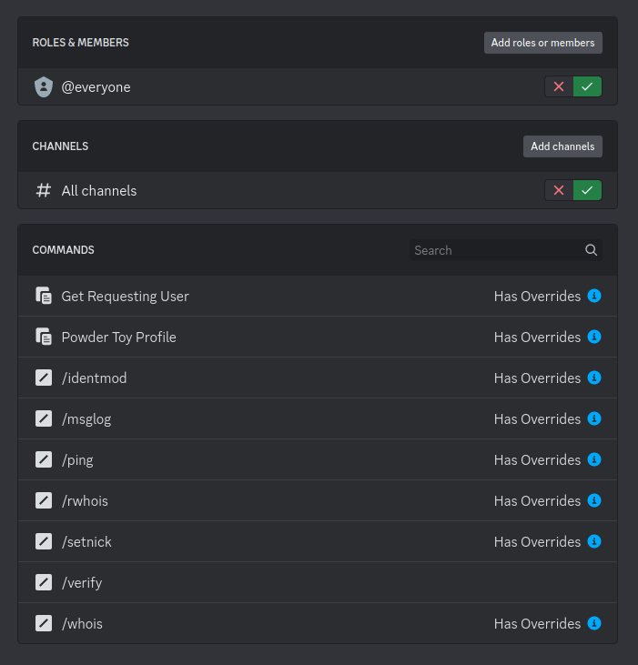

# TPT Discord Utility Bot

This is the source for our Discord bot known as TPT Utility Bot on
[the community Discord server](https://discord.gg/GaKFBPeV7d).

The bot handles the following user-facing tasks:

 - verification: encouraged users to link their Discord account with their TPT account;
   doing so grants them the Verified role, which on the official Discord server enables
   them to send images and use other features of the bot
 - nickname normalization: encouraged users to change their server nickname to match the
   name of their TPT account; the bot can do this if they click a button
 - save embeds: show the thumbnail of the save with extra information such as title,
   description, author, and score; in response to a message that begins with `id:ID` or `~ID`
 - user embeds: show the avatar of the user with extra information such as account age,
   reputation, and Discord name; in response to a message that begins with `user:NAME`

And also the following staff-facing tasks:

 - management of account links: provide tools to sort out issues stemming from accounts
   linked wrong, banned discord or TPT accounts, and other unforeseen problems that are beyond the simple verification flow
 - message log inspection: provide tools to inspect message history up to some point in
   the past, including previous versions of edited and deleted messages, depending on the amount of traffic

## Hosting the bot

The official bot is a private bot app that is meant to operate in the official Discord server.
As such, it is not possible to add to other servers, you will have to create your own app
and host the bot on your own machine if you want to have your own instance.

You can create your own app on [the Discord developer portal](https://discord.com/developers/applications),
making sure to note its client ID and client secret. Once you have an app, you just have to run
`bot.lua` on your machine.

### Installing dependencies

The bot is meant to be run on _anything but Windows_ ([a limitation of
cqueues](http://25thandclement.com/~william/projects/cqueues.html)) using
[Lua 5.3](https://www.lua.org/versions.html#5.3) or above. It has a number of
dependencies, namely:

 * `lunajson`
 * `http`
 * `lsqlite3`
 * `html-entities`
 * `lrexlib-pcre2`

If you have [LuaRocks](https://luarocks.org/), you can install these with:

```sh
sudo luarocks install --lua-version=5.3 --tree=system lunajson
sudo luarocks install --lua-version=5.3 --tree=system http
sudo luarocks install --lua-version=5.3 --tree=system lsqlite3
sudo luarocks install --lua-version=5.3 --tree=system html-entities
sudo luarocks install --lua-version=5.3 --tree=system lrexlib-pcre2
```

### Patching `lua-http`

As of 2023-11-01, [you also have to apply a patch](https://github.com/The-Powder-Toy/discord-utility-bot/issues/1)
to the `websocket` module of `lua-http` (consult your LuaRocks install to figure out where this file is exactly):

```diff
diff --git a/http/websocket.lua b/http/websocket.lua
index fe53f63..6c611a4 100644
--- a/http/websocket.lua
+++ b/http/websocket.lua
@@ -241,7 +241,7 @@ local function read_frame(sock, deadline)
        if frame.length == 126 then
                extra_fill_unget = assert(sock:xread(2, "b", 0))
                frame.length = sunpack(">I2", extra_fill_unget)
-               fill_length = fill_length - 2
+               fill_length = fill_length - 2 + frame.length
        elseif frame.length == 127 then
                extra_fill_unget = assert(sock:xread(8, "b", 0))
                frame.length = sunpack(">I8", extra_fill_unget)
```

### Providing configuration

The bot requires a `secret_config.lua` to be present in its working directory, structured as follows:

```lua
return {
    maintainer_id        = "000000000000000000", -- whom to ping if the bot dies
    app_id               = "000000000000000001", -- see discord documentation
    app_token            = "aaaaaaaaaaaahowareyouholdingupaaaaaaaaa", -- see discord documentation
    oauth_id             = "000000000000000002", -- see discord documentation
    oauth_secret         = "bbbbbbbbbbbbbbbbbbbbbbagelsbbbbbbbbbbbbbbbb", -- see discord documentation
    guild_id             = "000000000000000003", -- guild to operate in
    managed_role_id      = "000000000000000004", -- role to manage (Verified)
    user_role_ids        = { "000000000000000004", "000000000000000005", "000000000000000006" }, -- roles to accept Verified-only requests from
    mod_role_ids         = { "000000000000000007", "000000000000000008" }, -- roles to accept Mod-only requests from
    welcome_id           = "000000000000000009", -- channel to send welcome messages to (#welcome)
    verification_id      = "000000000000000010", -- channel to send verification requests to (#verification)
    embed_muted_role_ids = { "000000000000000011", "000000000000000012" }, -- roles to ignore embed request from
    backend_audience     = "ccccccccpotatoccccccc", -- backend audience (contact the backend maintainer for further info)
    backend_base         = "https://example.com", -- backend url (contact the backend maintainer for further info)
    http_listen_addr     = "0.0.0.0", -- listen address of the web server that receives redirects from the backend
    http_listen_port     = 1337, -- listen port of the web server that receives redirects from the backend
    theme_color          = 0xABCDEF, -- theme colour to use in all embeds
}
```

### Adding the bot to your server

Bot OAuth2 URL:

```
https://discord.com/api/oauth2/authorize?client_id=CLIENT_ID_HERE&permissions=402656256&scope=bot+applications.commands
```

This is a URL *template*, it is not usable in this form. You have to change `CLIENT_ID_HERE` to the client ID of your app.

The 402656256 in `permissions=402656256` is `0x18000C00` and entails the following permissions:

 - `0x00000400`: Read Messages/View Channels
 - `0x00000800`: Send Messages
 - `0x08000000`: Manage Nicknames
 - `0x10000000`: Manage Roles

As of 2023-11-01, the `applications.commands.permissions.update` OAuth2 scope has
been removed from the list of requested scopes, see below.

### Setting up command permissions in your Discord server

Acquiring an OAuth2 token with the `applications.commands.permissions.update` scope
[requires a more complicated OAuth2 authorization flow](https://discord.com/developers/docs/topics/oauth2#advanced-bot-authorization)
than practical (the full user-friendly bot authorization flow with a redirect URI rather than the simple one,
[especially if a team owns the app](https://discord.com/developers/docs/topics/oauth2#client-credentials-grant)), and even if one is acquired,
[its usefulness depends on the user](https://discord.com/developers/docs/interactions/application-commands#permissions)
who provides authorization (i.e. the user who adds the bot).

The upshot is that the bot does not set up access control lists for its commands, despite having all the required
information to do so in its configuration. It uses its configuration to implement *its own* access
control mechanism however, so unverified users will not be able to create embeds and only staff will be able to
use staff-only commands; the bot will just tell them that they have no permission to use them.
This is not particularly user-friendly on its own, as it litters the command lists of non-staff
users with commands that they cannot use, so server admins are expected to set up access controls on the Discord side
to hide them.

These access controls should be in accordance with those specified in the configuration,
which means that access to command should be enabled for @everyone, except if a command is
restricted to verified or staff users, in which case should have access overrides that disable
access for @everyone, but then enable access for all verified or staff roles, respectively, like this:



